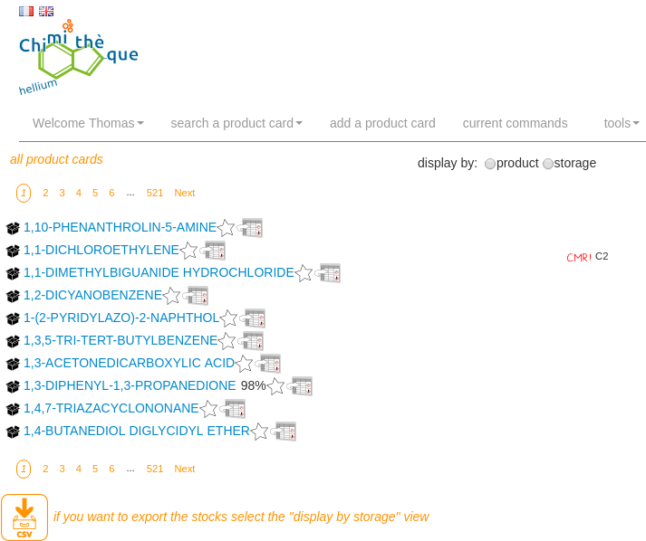

# Chimithèque

Chimithèque is an open source chemical product management application initially developped by the ENS-Lyon (France).

The project has started in 2015 and has moved to Github in 2017.
The old subversion repository can be found here: <https://sourcesup.renater.fr/scm/viewvc.php?root=chimitheque>

Why Chimithèque?  
We needed a global method to manage chemical products of the different departments and laboratories of the ENS to:
- improve the security with a precise global listing of the chemicals products stored in the entire school
- reduce waste by encouraging chemical products managers to search in Chimithèque if a product can be borrowed from another department before ordering a new one

# Screenshot



# Documentation (installation/upgrade and user guide)

The documentation has not yet been converted into Markdown. Please look at the 2 PDF files in the `ARCHIVES/documentation` directory.

# Upgrade quick reference

```bash
    $ /etc/init.d/apache2 stop
    $ cd /tmp
    $ wget https://github.com/tbellembois/chimitheque/releases/download/{version}/chimitheque-AMD64.tar.gz 
    $ tar -zxvf chimitheque-AMD64.tar.gz
    $ cd web2py
    $ rsync -avz ./* /usr/local/src/chimitheque_src/
    $ cd /usr/local/src/chimitheque_src/applications/chimitheque/
    $ ./chimitheque -c deploy -i prod -o
    $ /etc/init.d/apache2 start
```

# License

The application is and will remain free and released under CeCILL V2 licence. This is the french version of the GPL licence.

# Project mailing list

https://groupes.renater.fr/sympa/info/chimitheque

# Credits

### Fonctional coordinator
- Elodie Goy (chemical engineer and application developper)

### Design and development
- Serges Torres (LIP ENS-Lyon)
- Thomas Bellembois (UCA)
- Julien Devemy (UCA)

### Specifications and tests
- Sandrine Breteau (Health and Safety department - ENS-Lyon)
- Anouk Bedino (Health and Safety department - ENS-Lyon)
- Benjamin Gillet (IGFL - ENS-Lyon)
- Gilles Chatelain (LBMC - ENS-Lyon)
- Odile Coulombel (retired)

### Contributors
- Loïs Taulelle (PSMN - ENS-Lyon): open source license
- Delphine Pitrat (Chemical lab - ENS-Lyon): tests, features
- Laure-Lise Chapellet (Chemical lab - ENS-Lyon): tests, features
- ENS-Lyon Chemical lab: products database, tests, features
- Antoine Gallavardin (IRSTEA): tests
